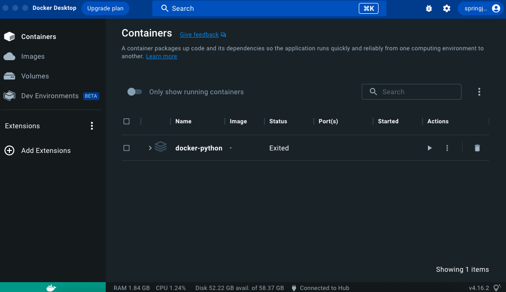

# Overview.

This is an environment for running python on docker.

---
---

## If there are changes to docker
Image creation and build
```
docker compose up -d --build
```

Connecting to Containers
```
docker compose exec python3 bash
```


---

## If there are no changes to docker
↓Click start on the image (you can also do this from the vscode function).



Connecting to Containers
```
docker compose exec python3 bash
```

